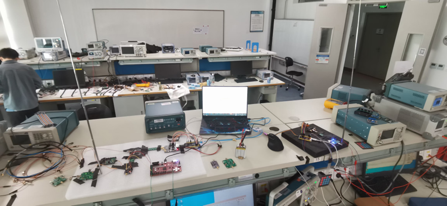
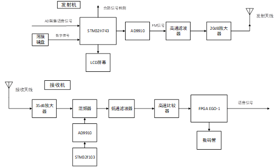
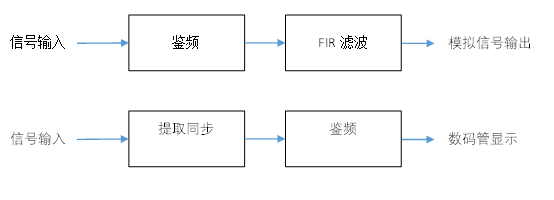

# 总结

21年全国大学生电子设计竞赛，大学期间唯一参加的一项比赛，花了相对较长的时间准备，最后得到国家二等奖的成绩，也算令人满意。

本题要求设计实现一套通信系统，在各题中属于门槛较高者，但竞争也相对较少，勉强实现基础和进阶要求就可以取得不错的成绩。

本人负责系统总体框架设计及FPGA代码设计，同时对电路设计及调试也有一定参与。本项目主要是对系统设计及FPGA代码内容的分享。

作品功能参见题目要求。

由于带宽限制，最终选择FM调制，虽然实测-30dB带宽勉强满足题目要求，但理论上应该是超出了带宽限制，测评时这也是主要的失分点。此外，窄带调频的抗噪性能较差，由此导致的信号失真也影响了系统的最终表现。

DSB调制应为更好的选择，载波同步可以借助已经实现的帧同步加上固定载波初相实现，FPGA数字混频也有实现的经验。但由于往届赛题对FM调制涉及更多的缘故，赛前对FM的准备更加充分，在比赛时间有限的情况下选择了更加稳健的FM调制方案。

## 摘要

本系统设计制作一套数模信号时分同传的FM收发系统。发射端实现数字输入，显示，调频发射；接收端实现发射数字数码管显示，语音信号输出。

发射机获取输入后，插入同步信号，合路，通过直接频率合成模块(DDS)调频输出。接收机经放大，混频，滤波，过零比较后经FPGA鉴频解调。

系统传输失真较小、算法效率高、发射机功率低，工作较稳定。

### 代码介绍

设备型号ego1

接收机将中频FM信号经比较器转为二值信号从GPIO输入FPGA，处理后由数码管显示数字信号，DAC输出模拟信号

数码管显示部分为FPGA实验内容

时分复用，以空帧作为帧同步标志

同步模块基于捕获-保持方式工作

输出端使用FIR滤波，参数由matlab生成

### 系统介绍

### 技术方案比较

#### 调制解调模块

方案一：DSB调制，下变频后采样，同步解调。发射功率较低，解调需载波同步，实现难度较高。

方案二：AM调制，包络检波解调。发射功率较高，解调难度低。

方案三：FM调制，下变频后过零计数鉴频解调。发射功率较低，窄带调频下带宽可满足设计要求，实现难度较高。

方案四：2FSK调制，过零计数鉴频解调。占用频带资源过大，无法满足带宽要求。

##### 综上分析，方案一、三较优，最终选择方案三频率调制。

#### 合路分路模块

方案一：时分复用。接收端同步后分路解调。

方案二：频分复用。数字信号频谱搬移至  调制发射。接收端滤波分路。

##### 方案二分路滤波器过渡带较窄，设计难度大，数模信号易串扰，选择方案一。

#### 发射端主控模块

方案一：FPGA主控。

方案二：STM32主控。

##### FPGA算法效率高，运算能力强，但功耗较大。STM32功耗较低，功能足够，功率较低。考虑功率，选择STM32主控。

#### 本地振荡模块

方案一：DDS模块

方案二：DAC模块

##### DAC模块输出采样率较低，波形存在失真，选择方案一。

### 接收机程序设计

接收信号下变频后由高速比较器转为数字信号输入FPGA实现鉴频解调。

#### 数值分析与计算

##### 带宽

由卡森公式 $B=2(\Delta_f+f_m)$ 可知25kHz带宽要求下频率调制最大频偏为2.5kHz。实测3kHz频偏下-40dB带宽在25kHz内，选定最大频偏为3kHz。

##### 采样率

模拟信号最大频率为10kHz。由奈奎斯特采样定律知采样率应高于20kHz。考虑工程上5至10倍采样率要求，取采样率为50kHz。

##### 数字信号传输间隔

传输时间要求2s内。4位10进制数总信息量为 $log_2(10^4)=13.2877$ ，数字信息最低比特率小于7bit/s。选择传输间隔为500ms，实测收发时延2s内。

##### 解调精度

接收机鉴频选择等精度鉴频法。 $相对精度=\frac{1}{闸门时间\times参考时钟频率}$ 选择中频300kHz，闸门时间16微秒，参考时钟频率100MHz。
鉴频精度为 $\frac{300k}{16\mu\times100M}=187.5Hz$ 。可以解调最大频偏3kHz的调频波。